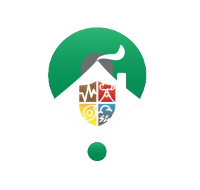
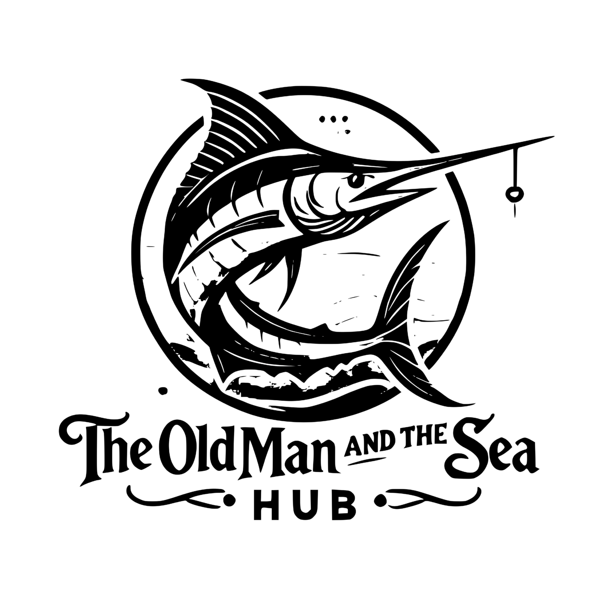

 

 

---

## 👋 About Me

I’m a **4th-year BSIT student at Bicol University (Main Campus)** and a self-driven developer focused on **web and mobile app development**.  
I enjoy turning ideas into **simple, reliable solutions** using modern tools, and I’m excited to join a team where I can **contribute, keep learning, and build real features that help users**.

**📍 Location:** Malinao, Albay • Legazpi City, Albay, Philippines  
**🎯 Interests:** Frontend Development • Backend Development • Frameworks • HTTP • APIs

---

## 🎓 Education

<table width="100%" align="center">
  <tr>
    <td align="left" valign="top" style="padding: 12px 14px;">
      <b>Bicol University (Main Campus)</b> 
      Bachelor of Science in Information Technology
    </td>
    <td align="right" valign="top" style="padding: 12px 14px; white-space: nowrap;">
      <b>Aug 2022 – Present</b>
    </td>
  </tr>
</table>

---

## 📅 Experiences

| Period | Role | Organization / Event | Notes |
| --- | --- | --- | --- |
| **2025-11** | Backend Developer | **Open iT Codefest 2025 (20hrs Hackathon)** | Built **Masid** — a real-time earthquake monitoring & alert platform (Team Snack Overflow). |
| **2025-12 – 2026-01** | Backend Developer | **1st Naga City Mayoral Hackathon** | Proposed **MyNagAlaga** — a shared infrastructure for MyNaga App with a **verify-once, connected-everywhere** model. |

---

## 🤝 Connect with Me

---

## 🚀 Technical Skills

### 💻 Languages

### 🎨 Frontend

### 📱 Mobile Development

### 🧩 Backend

### 🗄️ Databases

### 🛠️ Tools

-F05032?style=for-the-badge&logo=git&logoColor=white)

### ☁️ Deployment

---

## 🌟 Highlight Projects

<table width="100%">
<tr>
<td width="50%" valign="top" align="center">
<h3>e-LegTas</h3>

A GIS-based evacuation management system designed to support reporting and coordination for the <b>CDRRMO of Legazpi City, Albay</b>.

<b>Live:</b> <a href="https://www.e-legtas.tech/" target="_blank" rel="noreferrer">www.e-legtas.tech</a>

<b>Tech:</b> React • TypeScript • Redux • Node.js • Express.js • PostgreSQL • Supabase • Flutter • OpenStreetMap

&nbsp;&nbsp;

</td>
<td width="50%" valign="top" align="center">
<h3>SiyenSHOP</h3>

   

A web-based e-commerce platform for BU College of Science merchandise shops. Users can browse items, add to cart, and track orders.

<b>Status:</b> Not deployed (local setup)

<b>Tech:</b> Laravel • PHP • MySQL • Livewire • Tailwind CSS • JavaScript • Composer • Node.js

&nbsp;&nbsp;

</td>
</tr>
<tr>
<td width="50%" valign="top" align="center">
<h3>AliTapTap</h3>

A mobile e-commerce app for customizing and purchasing NFC business cards for personal and professional use.

<b>Live:</b> <a href="https://ali-tap-tap.vercel.app" target="_blank" rel="noreferrer">ali-tap-tap.vercel.app</a>

<b>Tech:</b> React Native • Expo • Node.js • Express • MongoDB • Socket.IO

&nbsp;&nbsp;

</td>
<td width="50%" valign="top" align="center">
<h3>Old Man and the Sea – Learning Hub</h3>

A kid-friendly, underwater-themed learning hub for Ernest Hemingway’s <b>The Old Man and the Sea</b> using cards, quizzes, and simple explanations to make the classic easier and more fun.

<b>Live:</b> <a href="https://old-man-and-the-sea.vercel.app" target="_blank" rel="noreferrer">old-man-and-the-sea.vercel.app</a>

<b>Tech:</b> React • TypeScript • Vite • Tailwind CSS • Supabase Auth

&nbsp;&nbsp;

</td>
</tr>
</table>

---

## 📊 GitHub Stats

